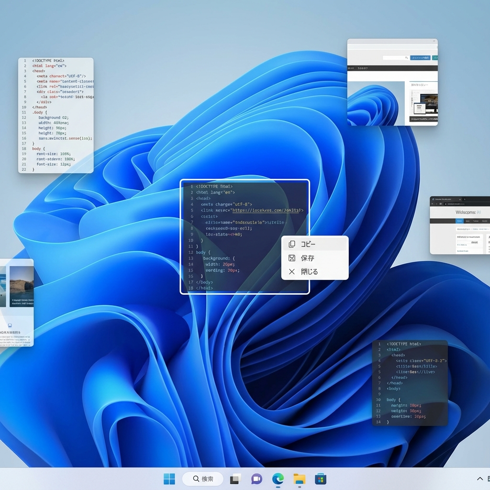
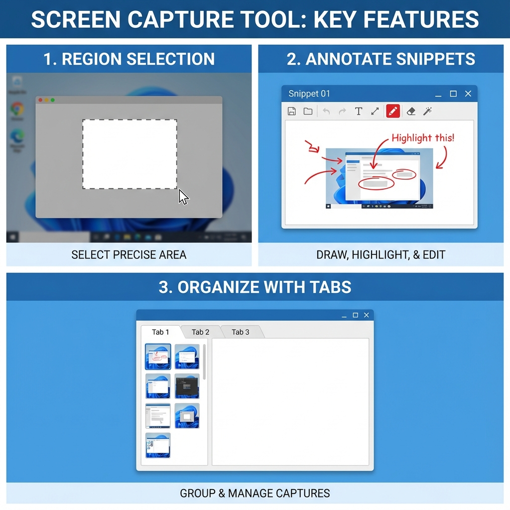

# SetunaCloneAG
Pythonで作成した、デスクトップ画面を切り取って常に最前面に表示（ピン留め）できるスクリーンキャプチャツールです。
SETUNA2の機能を参考に開発を行いました。



## 特徴


- **スマートキャプチャ**: 画面の一部を切り取り、最前面の「スニペットウィンドウ」として即座に表示。
- **直感的な操作**: マウスホイールによる拡大・縮小、ダブルクリックでのシェーディング（最小化）。
- **編集機能**: ペン描画・トリミング・アンドゥ機能を搭載し、その場でメモや加工が可能。
- **整理・管理**: 複数のスニペットをタブ付きウィンドウへ一つにまとめるグループ化機能。
- **常駐型**: タスクトレイに常駐し、いつでもホットキーでキャプチャを開始。

## ディレクトリ構成
```text
.
├── src/                # ソースコード (main.py, capture_tool.py etc.)
├── assets/             # 静的リソース (favicon.ico)
├── tests/              # テスト
└── start_setuna.bat    # 起動用バッチファイル
```

## 使い方
詳細は [MANUAL.md](./MANUAL.md) を参照してください。

### セットアップ
```bash
pip install -r requirements.txt
python src/main.py
```

### 操作
- **キャプチャ開始**: `Ctrl + Shift + Z`
- **スニペットを閉じる**: `Q` またはマウスホイールクリック
- **ペンモード切替**: `E`
- **トリミングモード切替**: `T`

## 動作環境
- Windows 10/11
- Python 3.10+

## 開発の背景
このプロジェクトは、伝説的なキャプチャツール「SETUNA2」の使い勝手をPython (Tkinter/Pillow) で再現することを目指して作成されました。
